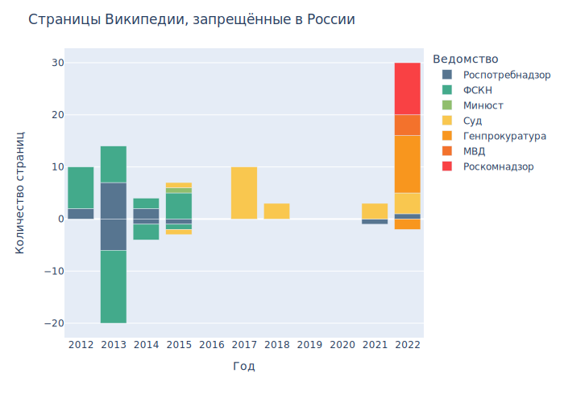

# График кол-во страниц Википедии, запрещённых в России по годам \ Graph of the number of Wikipedia pages banned in Russia by year

### Источник данных \ Source

[Страницы Википедии, запрещённые в России \ Wikipedia pages banned in Russia](https://ru.wikipedia.org/wiki/%D0%92%D0%B8%D0%BA%D0%B8%D0%BF%D0%B5%D0%B4%D0%B8%D1%8F:%D0%A1%D1%82%D1%80%D0%B0%D0%BD%D0%B8%D1%86%D1%8B_%D0%92%D0%B8%D0%BA%D0%B8%D0%BF%D0%B5%D0%B4%D0%B8%D0%B8,_%D0%B7%D0%B0%D0%BF%D1%80%D0%B5%D1%89%D1%91%D0%BD%D0%BD%D1%8B%D0%B5_%D0%B2_%D0%A0%D0%BE%D1%81%D1%81%D0%B8%D0%B8)

###  Описание данных \ Data Description
* 'Статья' — Название статьи \ Article title
* 'Дата основания' — Дата вынесения информации о блокировке \ Date when the block was issued 
* 'Дата внесения' — Дата вынесения информации в реестр \ Date when the block was entered into the registry
* 'Дата исключения' — Дата исключения из реестра \ Date of exclusion from the register
* 'Кто' - Ведомство внесшее в реестр \ Office that entered the register
* 'Год внесения' — Год вынесения информации в реестр \ Year when the block was entered into the registry
* 'Год исключения' — Год исключения из реестра \ Year of exclusion from the register

